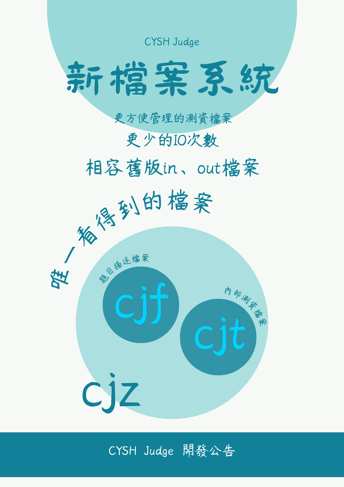

# CYSH Judge 檔案系統
# 檔案類型

## .cjz - CYSHJ題目檔
在進行傳輸時使用，單檔案，可透過我們特製的系統import。

## .cjf - CYSHJ描述檔
題目的描述、設定

## .cjt - CYSHJ測資檔
測資的檔案，將以往的in、out檔合併的新檔案模式。

[**檔案格式更新紀錄**](./update_logs/file_format.md)

# 檔案配置
    <any>.czj
     - question.cjf
     - tests.cjt
# 功能
## build.py
將指定資料夾匯出為cjz檔

**匯出同時會更新cjf**

## update.py
更新指定資料夾cjf檔

## read.py
展開cjz檔案並讀取
